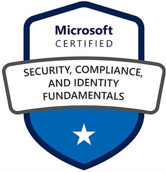

# Meu Portfólio de Certificações

Bem-vindo ao meu repositório de certificações profissionais! Aqui você encontrará uma lista completa das minhas conquistas em diversas plataformas e metodologias.

## Microsoft Azure

| Certificação | Badge |
|--------------|-------|
| AI-900: Azure AI Fundamentals |  |
| SC-900: Security, Compliance, and Identity Fundamentals |  |
| DP-900: Azure Data Fundamentals |  |
| AZ-104: Azure Administrator |  |
| AZ-305: Designing Microsoft Azure Infrastructure Solutions |  |
| AI-102: Designing and Implementing a Microsoft Azure AI Solution |  |

## Amazon Web Services (AWS)

| Certificação | Badge |
|--------------|-------|
| AWS Certified Cloud Practitioner |  |
| AWS Certified Solutions Architect - Associate |  |

## Google Cloud Platform (GCP)

| Certificação | Badge |
|--------------|-------|
| Google Cloud Certified - Associate Cloud Engineer |  |

## Métodos Ágeis

| Certificação | Badge |
|--------------|-------|
| Scrum Master Certified (SMC) |  |
| Professional Scrum Master I (PSM I) |  |

